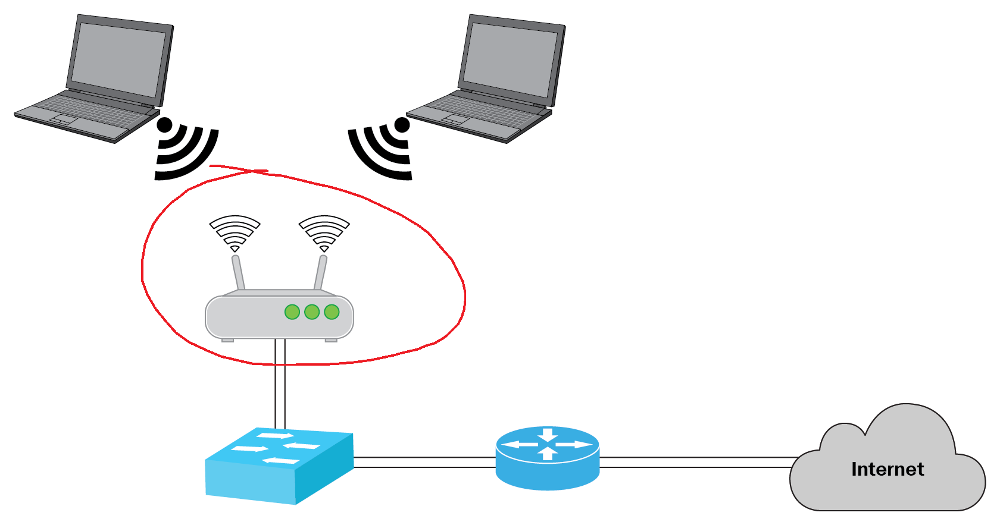

# Examination

## Relevanta betygskriterier
---
- Eleven planerar och utför i hård- och mjukvaruinstallation, uppbyggnad, konfigurering, uppgradering, optimering och felsökning samt åtgärdar fel i datorer och datorsystem. 

- Dessutom installerar eleven datorer i lokala nätverk. Eleven hanterar utrustning och verktyg samt utför arbetet på ett säkert sätt. 

- I arbetet använder eleven instruktioner, manualer, topologier och andra dokument på både svenska och engelska samt gör en  dokumentation av sitt arbete.

- När eleven samråder med handledare bedömer hon eller han  den egna förmågan och situationens krav.

- Eleven använder webbpubliceringssystem.

## Raspberry Pi

Du kan inte längre komma åt din Raspberry Pi över nätverket! 

Din uppgift är simpel! **Felsök och åtgärda problemet!** Dokumentera vad du provat och vad som var lösningen.

**LEDTRÅD**: majaroxx

Figur 1: Topologi över nätverket med inringat felområde.

 
\pagebreak 

### **E**   
- Problemet identifierat.
- Problemet åtgärdat.

### **C**   
- När problemet är åtgärdat tar du reda på din MAC-address på din Raspberry Pi och dokumenterar den.
- Du kan hitta MAC-addressen med kommandot `ifconfig`
    - MAC-addressen står efter ordet `ether` (under `eth0` om du har flera att välja mellan)
- Följande kommando kan fungera:
    - `ifconfig | grep "ether" | awk '{print $2}'`
- Exempel på MAC-address:
    - `b8:27:eb:4f:15:95`

### **A**
- Instruktioner efter nästa uppgift.

## GitHub

Vi vill kunna kolla på din hemsida för att göra bedömningen i webutvecklings-kursen.

### **E**

- Din hemsida du byggt gör du tillgänglig som en github page, genom att pusha din hemsida dill ditt repo "webdevpub". Se till att du har github pages aktiverat för din master/main branch.

### **C**

- Hämta koden `server.js` som ligger under foldern examination_datnat i repot `webdev_maja_2020`.
- Kör koden med kommandot:
    - `node server.js`
- Visa mig när du skriver följande på din dator:
    - `curl localhost:8080`

 
\pagebreak 

### **A**
- Kontrollera att du har node/npm på din RPi.
    - `node -v`
    - `npm -v`

    - Skippa dessa steg om du har node/npm på din RPi (alla bör ha det).
        - Ladda ned nodejs för RPi på kommandoraden med:
            -  `wget https://nodejs.org/dist/v14.17.0/node-v14.17.0-linux-armv7l.tar.xz`
        - Kopiera över filen till din RPi med `scp`: 
            - `scp node-v14.17.0-linux-armv7l.tar.xz username@hostname:`
        - ssh till din RPi:
            - `ssh username@hostname`
        - packa upp nodejs
            - `tar xvf node-v14.17.0-linux-armv7l.tar.xz`
        - installera
            - `cd node-v14.17.0-linux-armv7l/`
            - `sudo cp -R * /usr/local/`
        - kontrollera att installationen gick till korrekt
            - `node -v`
            - `npm -v`
- Använd scp för att kopiera över koden `server.js` från den senaste **C** uppgiften, till din RPi.
- Kör igång servern på din RPi.
- Låt mig köra följande mot din dator:
    - `curl hostname:8080`